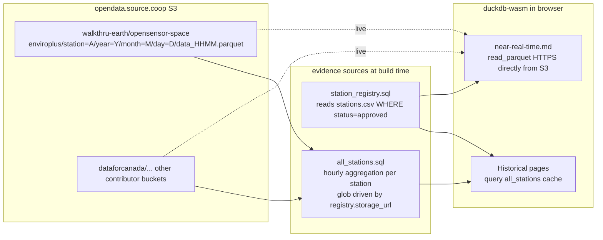
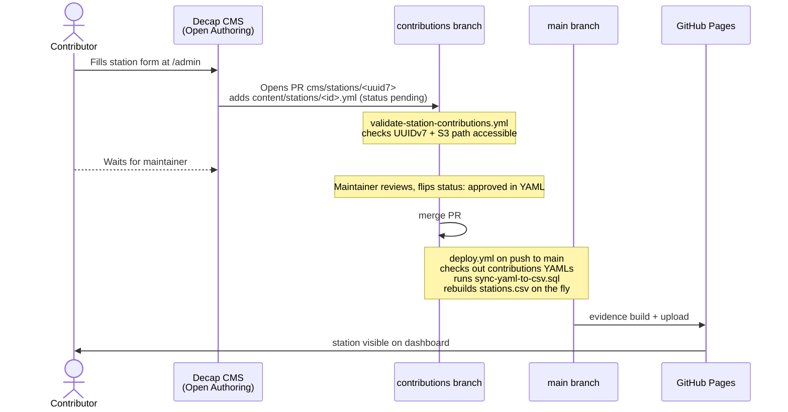

# OpenSensor Space

A decentralized Evidence.dev dashboard for environmental sensor data. Stations are community-contributed and stream telemetry into public S3 buckets as Hive-partitioned parquet. The site is a static build deployed to GitHub Pages; all page queries run in the browser via duckdb-wasm.

Live: https://walkthru-earth.github.io/opensensor-space/
Repo: https://github.com/walkthru-earth/opensensor-space

## Tech stack

- Evidence.dev (`@evidence-dev/evidence` ^40.1.8), SvelteKit-based
- DuckDB via `@evidence-dev/duckdb` for sources, duckdb-wasm for runtime queries
- Bun for install/scripts (Node >= 22 fallback)
- [Decap CMS](https://decapcms.org/) in Open Authoring mode, OAuth via a Cloudflare Worker (`opensensor-auth.walkthru-earth.workers.dev`), feeding the `contributions` branch
- GitHub Pages deploy, GitHub Actions workflows
- PostHog (`posthog-js`) for analytics

## Data architecture



Two query modes:
- **Cached hourly aggregate** (`sources/stations/all_stations.sql`) runs at build time, reads all station parquets across whichever buckets the registry points at, emits hourly averages. Most pages read this cache.
- **Runtime S3 fetch** (`pages/Stations/[station]/near-real-time.md`) constructs a 15-minute-bucketed HTTPS URL from `storage_url`, calls `read_parquet()` in duckdb-wasm, no build-time caching.

## Contribution flow



Approval rule: a station only appears on the dashboard when its YAML `status` field is `approved`. `pending` rows exist in `content/stations/*.yml` but are filtered out of `station_registry.sql`.

## Branches

- `main`: site source of truth, built and deployed
- `contributions`: holds `content/stations/*.yml` and the CMS workflows. Stripped-down tree (no app code). Decap/Sveltia CMS PRs merge here
- `cms/stations/<uuid7>`: ephemeral Decap CMS PR branches, delete after merge. For external (Open Authoring) contributors the branches live on the contributor's fork under `cms/<user>/opensensor-space/stations/<uuid>`
- ~~`contributions-clean`~~: legacy, delete
- ~~`station-update-*`~~: legacy bot-generated branches from the now-removed `process-approved-stations.yml` workflow, delete

## Key files

| Path | Purpose |
|---|---|
| `sources/stations/connection.yaml` | DuckDB in-memory source config |
| `sources/stations/stations.csv` | Snapshot of approved registry (regenerated at deploy) |
| `sources/stations/station_registry.sql` | Reads CSV, filters `status = 'approved'` |
| `sources/stations/all_stations.sql` | Hourly aggregation across all registered stations, driven by registry storage_urls |
| `sources/stations/sync-yaml-to-csv.sql` | Merges `content/stations/*.yml` from contributions branch into CSV |
| `pages/Stations/index.md` | Station map + table, uses `station_registry` |
| `pages/Stations/[station]/index.md` | Per-station detail, parametric on `${params.station}` |
| `pages/Stations/[station]/near-real-time.md` | Live read_parquet from S3 at current 15-min bucket |
| `pages/Stations/[station]/{temperature-and-humidity,gas-sensors,particulate-matter,pressure,light-and-proximity,health}.md` | Historical pages reading `all_stations` |
| `pages/architecture.md` | Public architecture page (mermaid diagrams) |
| `components/Mermaid.svelte` | Renders mermaid diagrams |
| `scripts/generate-seo.js` | Post-build: sitemap.xml, robots.txt, llms.txt, llms-full.txt |
| `.github/workflows/deploy.yml` | Build and deploy to Pages, runs `sync-yaml-to-csv.sql` inline |
| `.github/workflows/validate-station-contributions.yml` | On CMS PR: validate UUIDv7 + S3 path reachable, comment pass/fail |
| `static/admin/config.yml` | Decap CMS config (collections, fields, OAuth backend) |
| `static/admin/index.html` | Decap CMS entrypoint, served at `/admin` |
| `evidence.config.yaml` | Theme, plugins, color palette |
| `DEV.md` | Detailed notes on the near-real-time URL construction |

## Station YAML schema (content/stations/<id>.yml on contributions)

```yaml
station_id: <UUIDv7>
station_name: <display name>
sensor_type: enviroplus      # extend if new sensor families added
station_type: Indoor|Outdoor
location: '{"type":"Point","coordinates":[<lng>,<lat>]}'
storage_url: s3://<bucket>/<path>/  # MUST end with trailing slash
description: <markdown allowed>
contributor_name: <name>
contributor_url: <https url>
submitted_at: YYYY-MM-DD
status: pending|approved
```

## S3 partition convention

Every station publishes parquet under:
```
<storage_url>year=YYYY/month=MM/day=DD/data_HHMM.parquet
```
- `HHMM` is a 15-minute bucket: `HH` is the UTC hour, `MM` is `00|15|30|45`
- `storage_url` is expected to end with a trailing slash
- Hive partitioning on `year`, `month`, `day` lets DuckDB prune files by WHERE clause
- Primary bucket `s3://us-west-2.opendata.source.coop/walkthru-earth/opensensor-space/enviroplus/...` is the default; contributors can use their own bucket if it is publicly readable (AWS `--no-sign-request` works)

## Workflows

- **Deploy**: triggered on push to `main`, weekly cron (Monday 01:00 UTC), and manual dispatch. Checks out YAMLs from `contributions`, rebuilds `stations.csv` via DuckDB, runs `bun run sources` then `bun run build`, uploads Pages artifact
- **Validate contributions**: triggered on PR to `contributions` touching `content/stations/**`. Runs UUIDv7 regex, S3 `aws s3 ls --no-sign-request` check, comments on PR. About 18s
- No `process-approved-stations.yml` anymore. The YAML→CSV sync runs inside `deploy.yml`

## Known quirks and gotchas

- `status: pending` on a YAML means the station is invisible on the dashboard even though the row exists in CSV. Maintainers must flip to `approved` in the YAML on `contributions` for the station to appear
- `station_id` must be UUIDv7, validated by `validate-station-contributions.yml`
- `storage_url` must be public and end with `/`. Anonymous S3 access (`--no-sign-request`) is how we verify it
- DuckDB-wasm needs CORS on the parquet origin (`Access-Control-Allow-Origin`, range headers). `opendata.source.coop` currently serves this correctly for both subpaths
- Near-real-time SQL uses JavaScript `${new Date()...}` inside the SQL string. This works because Evidence evaluates the string before sending to DuckDB. Plain `${}` interpolation inside a `.md` SQL block only supports query results, `params.x`, `inputs.x`, and runtime JS expressions (see `DEV.md`)
- Evidence's `--changed` flag invalidates on SQL query text hash, not on upstream parquet mtimes. There is no native "only fetch new partitions" mode today. To avoid nightly full rebuilds, prefer shifting queries to runtime duckdb-wasm `read_parquet()` with Hive partition pruning
- `alembic/` and `src/` are empty scaffolding; there is no Python backend. Do not add migrations
- The `contributions-clean` branch is dead. Do not target PRs at it

## Running locally

```bash
bun install
bun run sources    # fetches and aggregates parquet from S3, writes .evidence/template/static/data/
bun dev            # opens http://localhost:3000
bun run build      # produces build/opensensor-space/ and runs scripts/generate-seo.js
```

First `bun run sources` may take several minutes while it scans all station partitions on S3.

## Direction of travel

- Historical page queries will move from cached aggregates to runtime `read_parquet(<storage_url>...**/*.parquet', hive_partitioning=true)` so builds stop being a data pipeline
- A tiny partition catalog source (one S3 LIST per station emitted as parquet) will back dropdowns so the user only ever picks date ranges that exist
- Once the migration is complete the weekly cron can be deleted entirely; deploys become pure static compile and run in under a minute
