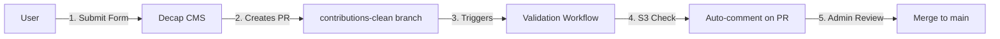
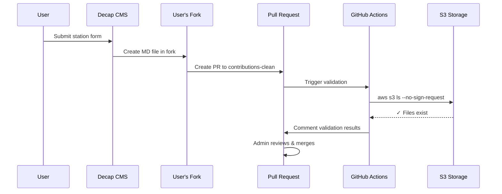

# Contributing Stations to OpenSensor

## Quick Start

1. Go to [opensensor.space/admin](https://opensensor.space/admin/)
2. Sign in with GitHub
3. Fill out the station form (you'll need to generate a UUIDv7 at [uuidgenerator.net/version7](https://www.uuidgenerator.net/version7))
4. Submit → PR created → Auto-validated → Merged

## Workflow Overview

## Detailed Flow

## Branches

| Branch | Purpose |
|--------|---------|
| `main` | Production - Evidence dashboard |
| `contributions-clean` | CMS submissions (YAML files) |

## Files

| File | Description |
|------|-------------|
| `content/stations/*.yml` | Station submissions (on contributions-clean) |
| `sources/stations/stations.csv` | Station registry (on main) |
| `scripts/merge-station-contributions.sql` | DuckDB script to merge YAML → CSV |

## Station Status

- `pending` - Awaiting validation
- `approved` - Validated and visible on dashboard

## Requirements

Your S3 storage URL must:
- Be publicly accessible (no auth required)
- Contain Parquet files in the expected structure
- Follow the path format: `s3://bucket/path/to/station/`
