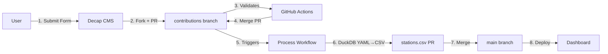
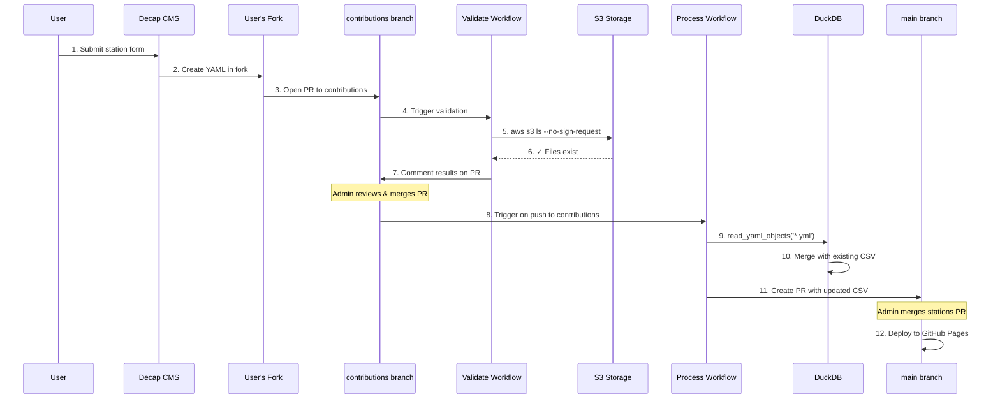
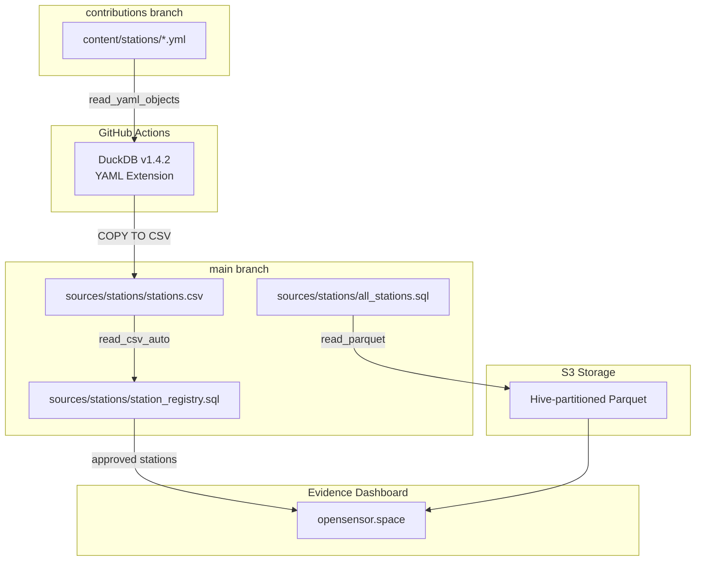

# Contributing Stations to OpenSensor

## Quick Start

1. Go to [opensensor.space/admin](https://opensensor.space/admin/)
2. Sign in with GitHub (this forks the repo to your account)
3. Fill out the station form
4. Submit → PR created → Auto-validated → Merged to CSV

## Workflow Overview



## Detailed Flow



## Data Flow



## Branches

| Branch | Purpose |
|--------|---------|
| `main` | Production - Evidence dashboard, stations.csv |
| `contributions` | CMS submissions (YAML files) |

## Files

| File | Location | Description |
|------|----------|-------------|
| `content/stations/*.yml` | contributions | Station YAML submissions |
| `sources/stations/stations.csv` | main | Station registry (CSV) |
| `sources/stations/station_registry.sql` | main | Query approved stations |
| `sources/stations/all_stations.sql` | main | Query sensor data from S3 |

## Station Status

| Status | Description |
|--------|-------------|
| `pending` | Newly added, awaiting approval |
| `approved` | Validated and visible on dashboard |

## DuckDB Queries

### Station Registry (station_registry.sql)

```sql
SELECT * FROM read_csv_auto('sources/stations/stations.csv')
WHERE status = 'approved'
```

### All Stations Data (all_stations.sql)

```sql
SELECT
    station as station_id,
    date_trunc('hour', timestamp) as timestamp,
    round(avg(temperature), 2) as temperature,
    -- ... other metrics
FROM read_parquet(
    's3://us-west-2.opendata.source.coop/walkthru-earth/opensensor-space/enviroplus/**/*.parquet',
    union_by_name=true,
    hive_partitioning=true
)
GROUP BY station, date_trunc('hour', timestamp)
```

### YAML to CSV Processing (GitHub Actions)

```sql
INSTALL yaml FROM community;
LOAD yaml;

-- Read YAML files (struct access via yaml.field)
SELECT
    yaml.station_id,
    yaml.station_name,
    CAST(json_extract(yaml.location::JSON, '$.coordinates[1]') AS DOUBLE) as latitude,
    CAST(json_extract(yaml.location::JSON, '$.coordinates[0]') AS DOUBLE) as longitude,
    -- ... other fields
FROM read_yaml_objects('content/stations/*.yml')
```

## Requirements

Your S3 storage URL must:
- Be publicly accessible (no auth required)
- Contain Parquet files with hive partitioning
- Follow the path format: `station={STATION_ID}/year={year}/month={month}/day={day}/*.parquet`

## Validation Checks

1. **UUIDv7 Format** - Station ID must be valid UUIDv7
2. **S3 URL Format** - Must start with `s3://`
3. **S3 Accessibility** - Path must be publicly listable
4. **Parquet Files** - Data must exist in the specified location
