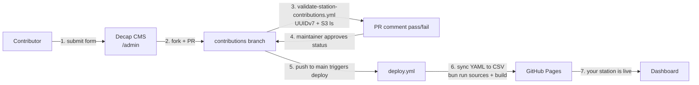
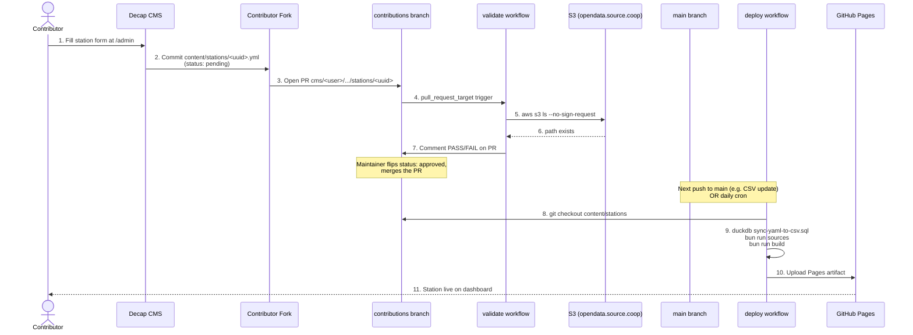
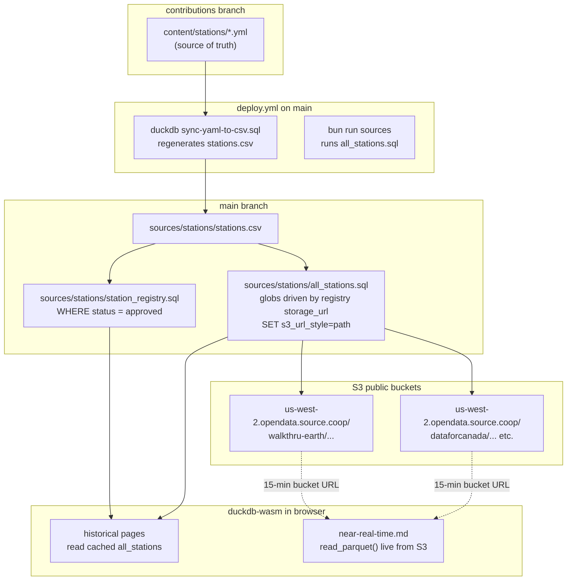

# Contributing Stations to OpenSensor

## Quick Start

1. Go to [opensensor.space/admin](https://opensensor.space/admin/)
2. Sign in with GitHub (this forks the repo to your account)
3. Fill out the station form and save
4. Decap CMS opens a PR from your fork to the `contributions` branch
5. Automated validation runs against your S3 path
6. A maintainer flips `status` from `pending` to `approved` and merges
7. On the next deploy, your station appears on the dashboard

## Workflow overview


```mermaid
flowchart LR
  A[Contributor] -->|1. submit form| B[Decap CMS<br/>/admin]
  B -->|2. fork + PR| C[contributions branch]
  C -->|3. validate-station-contributions.yml<br/>UUIDv7 + S3 ls| V[PR comment pass/fail]
  V -->|4. maintainer approves status| C
  C -->|5. push to main triggers deploy| D[deploy.yml]
  D -->|6. sync YAML to CSV<br/>bun run sources + build| G[GitHub Pages]
  G -->|7. your station is live| U[Dashboard]
```

## Detailed flow


```mermaid
sequenceDiagram
  actor C as Contributor
  participant CMS as Decap CMS
  participant Fork as Contributor Fork
  participant CB as contributions branch
  participant VW as validate workflow
  participant S3 as S3 (opendata.source.coop)
  participant M as main branch
  participant DW as deploy workflow
  participant GP as GitHub Pages

  C->>CMS: 1. Fill station form at /admin
  CMS->>Fork: 2. Commit content/stations/<uuid>.yml<br/>(status: pending)
  Fork->>CB: 3. Open PR cms/<user>/.../stations/<uuid>
  CB->>VW: 4. pull_request_target trigger
  VW->>S3: 5. aws s3 ls --no-sign-request
  S3-->>VW: 6. path exists
  VW->>CB: 7. Comment PASS/FAIL on PR
  Note over CB: Maintainer flips status: approved,<br/>merges the PR
  Note over M,DW: Next push to main (e.g. CSV update)<br/>OR daily cron
  DW->>CB: 8. git checkout content/stations
  DW->>DW: 9. duckdb sync-yaml-to-csv.sql<br/>bun run sources<br/>bun run build
  DW->>GP: 10. Upload Pages artifact
  GP-->>C: 11. Station live on dashboard
```

## Data flow


```mermaid
flowchart TB
  subgraph contributions[contributions branch]
    YAML["content/stations/*.yml<br/>(source of truth)"]
  end

  subgraph deploy[deploy.yml on main]
    SYNC["duckdb sync-yaml-to-csv.sql<br/>regenerates stations.csv"]
    SOURCES["bun run sources<br/>runs all_stations.sql"]
  end

  subgraph main[main branch]
    CSV[sources/stations/stations.csv]
    REG[sources/stations/station_registry.sql<br/>WHERE status = approved]
    AGG["sources/stations/all_stations.sql<br/>globs driven by registry storage_url<br/>SET s3_url_style=path"]
  end

  subgraph browser[duckdb-wasm in browser]
    HIST[historical pages<br/>read cached all_stations]
    LIVE["near-real-time.md<br/>read_parquet() live from S3"]
  end

  subgraph storage[S3 public buckets]
    P1[us-west-2.opendata.source.coop/<br/>walkthru-earth/...]
    P2[us-west-2.opendata.source.coop/<br/>dataforcanada/... etc.]
  end

  YAML --> SYNC
  SYNC --> CSV
  CSV --> REG
  CSV --> AGG
  AGG --> P1
  AGG --> P2
  REG --> HIST
  AGG --> HIST
  P1 -. 15-min bucket URL .-> LIVE
  P2 -. 15-min bucket URL .-> LIVE
```

## Branches

| Branch | Purpose |
|---|---|
| `main` | Production site, built by `deploy.yml` to GitHub Pages |
| `contributions` | YAML source of truth for the station registry, CMS merges land here |
| `cms/<user>/.../stations/<uuid>` | Ephemeral PR branches created by Decap CMS, auto-deleted on merge |

## Files

| File | Location | Description |
|---|---|---|
| `content/stations/<id>.yml` | `contributions` | One YAML per station, written by Decap CMS |
| `sources/stations/stations.csv` | `main` | Materialized registry, regenerated every deploy |
| `sources/stations/station_registry.sql` | `main` | Filters CSV to approved rows |
| `sources/stations/all_stations.sql` | `main` | Hourly aggregation across all approved stations, multi-bucket aware |
| `sources/stations/sync-yaml-to-csv.sql` | `main` | DuckDB script that reads YAMLs and writes the CSV |
| `static/admin/config.yml` | `main` | Decap CMS field schema |
| `.github/workflows/deploy.yml` | `main` | Build and deploy, runs on push + daily cron |
| `.github/workflows/validate-station-contributions.yml` | `main`, `contributions` | On CMS PR: UUIDv7 + S3 check |

## Station status

| Status | Visible on dashboard |
|---|---|
| `pending` | No, filtered out by `station_registry.sql` |
| `approved` | Yes |

Status lives in the YAML (`content/stations/<id>.yml` on the `contributions` branch). Maintainers flip the field and merge; no separate approval workflow exists anymore.

## Where your parquet data should live

A station's `storage_url` must:

- Be a publicly readable S3 URL ending with a trailing slash
- Be listable anonymously: `aws s3 ls <storage_url> --no-sign-request`
- Contain Hive-partitioned parquet following:

```
<storage_url>year=YYYY/month=MM/day=DD/data_HHMM.parquet
```

where `HHMM` is a 15-minute bucket (`HH` the UTC hour, `MM` one of `00 15 30 45`).

Default bucket: `s3://us-west-2.opendata.source.coop/walkthru-earth/opensensor-space/enviroplus/station=<id>/`. Contributors with their own public `source.coop` bucket (e.g. `dataforcanada/...`) are fully supported. The registry drives the parquet glob, no file edits required.

### source.coop note

`source.coop` bucket names contain dots, which breaks virtual-hosted SSL. `all_stations.sql` sets `s3_url_style = 'path'` and `s3_region = 'us-west-2'` so DuckDB resolves URLs as `https://s3.us-west-2.amazonaws.com/<bucket>/<path>`. If you host parquet on a bucket in a different region, coordinate with maintainers first.

## Validation checks (run automatically on your PR)

1. UUIDv7 format for `station_id`
2. S3 URL starts with `s3://` and follows `s3://<bucket>/<path>/`
3. Path is publicly listable via `aws s3 ls --no-sign-request`

A green check + `validation passed` comment means the PR is ready for maintainer review.

## What maintainers do

1. Read the PR, open the storage URL, sanity check the YAML
2. Edit the YAML field `status: pending` → `status: approved`
3. Merge the PR into `contributions`

The next deploy (or `workflow_dispatch`) pulls the latest YAMLs, rebuilds `stations.csv`, re-aggregates hourly data, and publishes.

## Local development

```bash
bun install
bun run sources    # scans S3 via all_stations.sql, writes .evidence/template/static/data/
bun run dev        # opens http://localhost:3000
bun run build      # produces build/opensensor-space/ and runs SEO generation
```

First `bun run sources` may take several minutes as it scans every approved station's S3 partitions.
